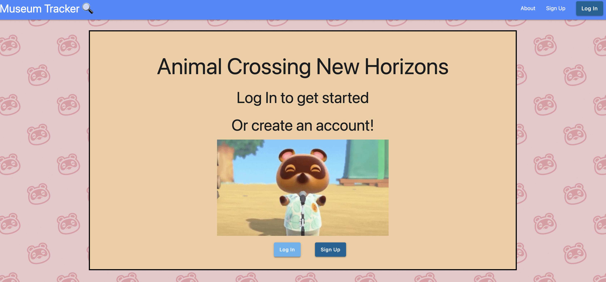
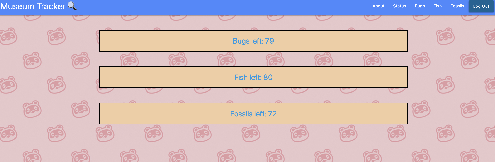

# ACNH Museum tracker 🔍

<h3>Walk Through of Our Project</h3>
<h3>Visit our about page to read why we created this website!😄</h3> 

Logging In

 
To log in, simply click the log in button and sign in with your username and password.
If you are new to the site, click the "sign up" button to create an account for future logins.

Collectibles

 
See how many of each collectible you have left to collect!🔍
Click on one to see a list of those collectibles!

Item Lists

 
View the list of items you have not collected yet. Select "details" when you need any information on 
where or when to find that specific collectible. Select "Got It!" when you have collected that item to 
move it into your museum!

Configuration Pages

 
See what items you have in your museum. When "Got It!" is selected, the collectible will have a check mark next to it. The user is able to check and uncheck multiple items in the case of a mistake being made. To submit the changes you have manually made, please click on the "submit changes" button located at the bottom of this page.

<h2>Links</h2>
<h3>PitchDeck with Wireframes & ERD</h3>
<a href="https://docs.google.com/presentation/d/1hSvMbeh3tumd23tFobdpVU4SNaY2C3vNPDBU97DwbbE/edit#slide=id.p">PitchDeck</a>
 
<h3>Trello Board</h3>
<a href="https://trello.com/b/Cb7wbZp8/acnh-museum-tracker">Trello</a>

